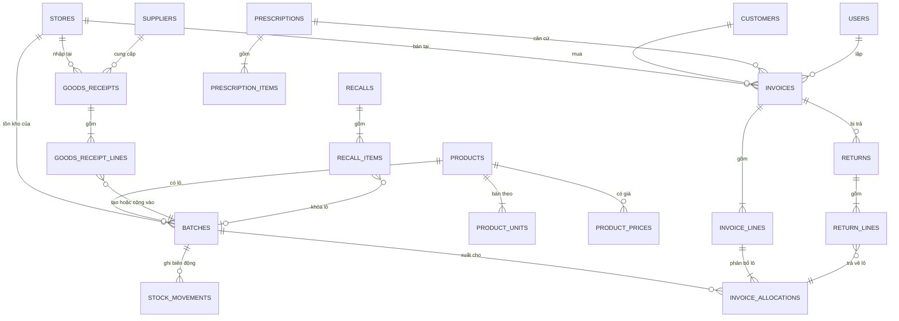
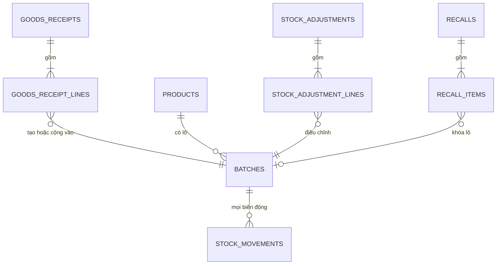
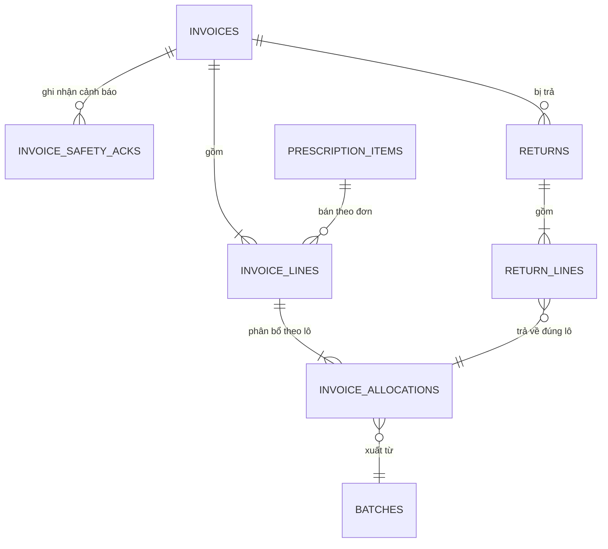

# Thiết kế dữ liệu (ERD) – Phần mềm quản lý nhà thuốc GPP

| Mục | Giá trị |
|---|---|
| Phiên bản tài liệu | 1.1 (bản nháp) |
| Ngày | 12/09/2026 |
| Thay đổi ở 1.1 | Thiết kế sẵn cho **chuỗi nhiều nhà thuốc**: thêm bảng `stores` và cột `store_id` (§1.8) |
| Căn cứ | `docs/api-contract.md` v2.1 |
| CSDL | PostgreSQL 17 |
| Phạm vi | Toàn bộ bảng cho MVP ở §22 của contract |

> Ba vấn đề Critical được chặn ngay ở tầng CSDL: **C1** bằng ràng buộc duy nhất trên thẻ kho và bảng khóa idempotency; **C2** bằng việc mọi số lượng tồn chỉ lưu theo đơn vị nhỏ nhất; **C3** bằng cột trạng thái lô cùng chỉ mục FEFO chỉ chứa lô bán được.

---

## 1. Quy ước chung của lược đồ

### 1.1 Đặt tên

- Bảng: `snake_case`, số nhiều (`products`, `invoice_lines`).
- Cột: `snake_case`. API dùng camelCase, ánh xạ ở tầng truy cập dữ liệu (§2 contract).
- Khóa ngoại đặt tên `<bảng_số_ít>_id` (`product_id`, `batch_id`).
- Bảng chi tiết của chứng từ đặt tên `<chứng_từ>_lines`.

### 1.2 Khóa chính

| Nhóm bảng | Kiểu khóa | Lý do |
|---|---|---|
| Nghiệp vụ (products, batches, invoices…) | `uuid` mặc định `gen_random_uuid()` | Sinh được ở tầng ứng dụng trước khi ghi, không lộ số lượng bản ghi, hợp với quy ước “ID là chuỗi mờ” |
| Sổ chỉ ghi thêm (`stock_movements`, `audit_logs`, `ai_logs`, `storage_logs`, `idempotency_keys`) | `bigint GENERATED ALWAYS AS IDENTITY` | Tăng dần theo thứ tự ghi nên dùng luôn làm con trỏ phân trang; chỉ mục nhỏ và ghi nhanh hơn `uuid` |
| Bảng nối (`user_roles`, `role_permissions`, `product_ingredients`) | Khóa chính tổ hợp | Không cần id riêng |

`gen_random_uuid()` có sẵn trong PostgreSQL 13 trở lên, không cần cài extension.

### 1.3 Kiểu dữ liệu

| Loại dữ liệu | Kiểu | Ghi chú |
|---|---|---|
| Số tiền (VND) | `bigint` | Số nguyên đồng. Không dùng `float` |
| Giá vốn trên đơn vị nhỏ nhất | `numeric(18,4)` | Chia lẻ được, ví dụ 100.000 đ cho hộp 30 viên |
| Thuế suất, phần trăm | `numeric(5,2)` | |
| Số lượng | `integer` | Luôn theo **đơn vị nhỏ nhất** khi là số tồn |
| Thời điểm | `timestamptz` | Lưu UTC, hiển thị theo giờ Việt Nam |
| Ngày nghiệp vụ, hạn dùng | `date` | Không kèm giờ |
| Trạng thái, mã loại | `text` + `CHECK (... IN (...))` | Xem 1.4 |
| Dữ liệu tự do | `jsonb` | `before`/`after` của audit log, kết quả AI |

### 1.4 Vì sao dùng `text + CHECK` thay cho kiểu `ENUM`

Kiểu `ENUM` của PostgreSQL thêm giá trị mới được nhưng **không xóa hay đổi tên giá trị cũ** nếu không tạo lại kiểu, và mọi thay đổi đều khóa bảng. `text` kèm `CHECK` sửa bằng một câu `ALTER TABLE ... DROP CONSTRAINT` rồi `ADD CONSTRAINT`, đọc dữ liệu thô cũng dễ hiểu hơn. Đổi lại, tên trạng thái chiếm nhiều byte hơn, không đáng kể ở quy mô một nhà thuốc.

### 1.5 Cột dùng chung

| Cột | Có ở đâu | Ghi chú |
|---|---|---|
| `created_at timestamptz NOT NULL DEFAULT now()` | Mọi bảng | |
| `updated_at timestamptz NOT NULL DEFAULT now()` | Bảng sửa được | Cập nhật bằng trigger |
| `created_by`, `updated_by uuid REFERENCES users(id)` | Bảng nghiệp vụ | Người thao tác, lấy từ phiên đăng nhập |
| `version integer NOT NULL DEFAULT 1` | Bảng có `PATCH` | Khóa lạc quan (§2.5 contract) |
| `is_active boolean NOT NULL DEFAULT true` | Danh mục | Thay cho xóa vật lý |

Chứng từ nghiệp vụ **không có `is_active`**; chúng dùng cột `status` riêng theo §5 của contract.

### 1.6 Extension và hàm phụ trợ

```sql
CREATE EXTENSION IF NOT EXISTS unaccent;
CREATE EXTENSION IF NOT EXISTS pg_trgm;

-- unaccent() mặc định là STABLE nên KHÔNG dùng trực tiếp trong chỉ mục
-- hay cột sinh. Bọc lại thành hàm IMMUTABLE mới tạo được chỉ mục.
CREATE OR REPLACE FUNCTION f_unaccent(text)
RETURNS text
LANGUAGE sql IMMUTABLE PARALLEL SAFE STRICT AS
$$ SELECT public.unaccent('public.unaccent'::regdictionary, $1) $$;
```

Đây là cái bẫy hay gặp: viết thẳng `CREATE INDEX ... (unaccent(name))` sẽ bị PostgreSQL từ chối với thông báo *functions in index expression must be marked IMMUTABLE*.

### 1.7 Hai quyết định giúp lược đồ gọn hơn

**Không có cột `products.base_unit_id`.** Nếu `products` trỏ sang `product_units` và `product_units` lại trỏ ngược về `products` thì thành khóa ngoại vòng tròn, rất phiền khi thêm mới và khi xóa dữ liệu test. Thay vào đó, đơn vị cơ bản là đơn vị có `conversion_to_base = 1`, và một chỉ mục duy nhất từng phần bảo đảm mỗi sản phẩm chỉ có đúng một đơn vị như vậy.

**Tồn đầu kỳ dùng chung bảng với phiếu nhập.** `goods_receipts` có cột `type` nhận `PURCHASE` hoặc `OPENING_BALANCE`. Cả hai đi qua đúng một đường ghi sổ kho, nên không phải viết lại logic tạo lô và cộng tồn. Endpoint vẫn tách riêng như contract quy định.

### 1.8 Mô hình nhiều nhà thuốc

Nhóm đã xác định sẽ mở rộng thành chuỗi, nên `store_id` có mặt **ngay từ migration đầu tiên**. MVP vẫn vận hành với một cửa hàng duy nhất (một dòng trong `stores`), nhưng khi mở cửa hàng thứ hai thì không phải chuyển đổi dữ liệu.

**Bảng `stores`**: `id uuid PK`, `code text UNIQUE` (ví dụ `NT01`), `name`, `address`, `phone`, `gpp_certificate_number`, `license_number`, `is_active`, cột chung.

#### Ba mức phạm vi dữ liệu

| Mức | Ý nghĩa | Bảng |
|---|---|---|
| **Dùng chung toàn chuỗi** | Một bản duy nhất, mọi cửa hàng thấy như nhau | `categories`, `active_ingredients`, `products`, `product_ingredients`, `product_units`, `product_barcodes`, `suppliers`, `roles`, `permissions`, `customers` và hai bảng hồ sơ sức khỏe, `recalls`, `recall_items` |
| **Riêng theo cửa hàng** | Có cột `store_id uuid NOT NULL` | `batches`, `stock_movements`, `goods_receipts`, `stock_adjustments`, `invoices`, `returns`, `prescriptions`, `storage_locations`, `storage_logs`, `audit_logs`, `ai_logs` |
| **Chung nhưng ghi đè được** | `store_id NULL` nghĩa là áp dụng toàn chuỗi | `product_prices`, `settings`, `user_roles` |

Khách hàng dùng chung toàn chuỗi để khách mua ở cửa hàng nào cũng tra được lịch sử và hồ sơ dị ứng. Đơn thuốc có `store_id` là **nơi tiếp nhận**, nhưng vẫn bán được ở cửa hàng khác trong chuỗi vì dữ liệu đơn là chung.

Bảng chi tiết (`*_lines`, `invoice_allocations`) không cần lặp lại `store_id` của chứng từ cha, trừ một ngoại lệ ở ngay dưới.

#### Chặn lẫn dữ liệu giữa các cửa hàng bằng khóa ngoại tổ hợp

Nguy hiểm nhất là bán lô của cửa hàng khác. Chỉ cần một chỗ quên lọc `store_id` là tồn kho hai cửa hàng lẫn vào nhau. Cách chặn triệt để là để chính CSDL kiểm tra:

```sql
-- Khóa phụ phục vụ khóa ngoại tổ hợp
ALTER TABLE batches ADD CONSTRAINT batches_id_store_uniq UNIQUE (id, store_id);

-- Dòng phân bổ lô mang store_id và phải khớp cửa hàng của lô
ALTER TABLE invoice_allocations
  ADD CONSTRAINT allocations_batch_same_store
  FOREIGN KEY (batch_id, store_id) REFERENCES batches (id, store_id);

-- Thẻ kho cũng vậy
ALTER TABLE stock_movements
  ADD CONSTRAINT movements_batch_same_store
  FOREIGN KEY (batch_id, store_id) REFERENCES batches (id, store_id);
```

Nhờ vậy, một hóa đơn của cửa hàng A không thể trỏ vào lô của cửa hàng B, kể cả khi mã ứng dụng có lỗi.

#### Các khóa duy nhất phải đổi

| Bảng | Trước | Sau |
|---|---|---|
| `batches` | `UNIQUE (product_id, batch_number)` | `UNIQUE (store_id, product_id, batch_number)` |
| `storage_locations` | `code` làm khóa chính | `id uuid PK`, `UNIQUE (store_id, code)` |
| Số chứng từ (`invoices.code`, `goods_receipts.code`…) | Tuần tự toàn hệ thống | Có tiền tố mã cửa hàng, ví dụ `HD-NT01-20260912-0001`, vẫn `UNIQUE` toàn hệ thống |

Cùng một số lô của cùng một thuốc tồn tại độc lập ở hai cửa hàng, vì đó là hai khối hàng khác nhau, nhập theo hai phiếu khác nhau.

#### Phân quyền theo cửa hàng

`user_roles` thêm `store_id uuid NULL`; giá trị `NULL` nghĩa là vai trò áp dụng cho **toàn chuỗi** (chủ chuỗi, kiểm toán viên). `users` thêm `default_store_id` để mở app là vào đúng cửa hàng quen thuộc.

PostgreSQL coi mỗi `NULL` là một giá trị khác nhau, nên `UNIQUE (user_id, role_id, store_id)` thông thường **không** chặn được hai dòng cùng `NULL`. Từ PostgreSQL 15 có cú pháp xử lý đúng việc này:

```sql
ALTER TABLE user_roles
  ADD CONSTRAINT user_roles_uniq
  UNIQUE NULLS NOT DISTINCT (user_id, role_id, store_id);
```

Cùng cách đó cho `settings (key, store_id)` và `product_prices (product_unit_id, store_id, effective_from)`: một dòng `store_id NULL` là mặc định toàn chuỗi, dòng có `store_id` là bản ghi đè của riêng cửa hàng. Khi tra cứu, lấy bản của cửa hàng trước, không có thì lấy bản chung.

#### Bảo đảm không lộ dữ liệu chéo cửa hàng

Mọi truy vấn thuộc phạm vi cửa hàng phải lọc theo `store_id`. Có hai cách:

1. **Lọc ở tầng service** — mọi hàm repository bắt buộc nhận `storeId`, không có đường vòng. Đơn giản, nhưng quên một chỗ là lộ dữ liệu.
2. **Row Level Security của PostgreSQL** — đặt `SET LOCAL app.current_store_id` đầu mỗi transaction rồi để CSDL tự lọc. Chặt hơn nhưng phức tạp hơn khi dùng chung với ORM.

Đề xuất cho MVP: dùng cách 1, kèm **test tích hợp cho từng endpoint**: tài khoản thuộc cửa hàng A gọi vào dữ liệu của cửa hàng B phải nhận `404` hoặc `403`, không bao giờ nhận dữ liệu. Thiết kế này đã sẵn sàng cho RLS nếu sau muốn siết: mọi bảng đều mang `store_id` trực tiếp nên không phải join để biết chủ sở hữu.

#### Chuyển kho giữa các cửa hàng

Để sau MVP (`stock_transfers`), nhưng danh sách loại của thẻ kho dành sẵn hai giá trị `TRANSFER_IN` và `TRANSFER_OUT` để sau này thêm chỉ là mở rộng `CHECK`, không phải sửa dữ liệu cũ.

---

## 2. Danh sách bảng

| Nhóm | Bảng |
|---|---|
| Hệ thống | `stores`, `users`, `roles`, `permissions`, `role_permissions`, `user_roles`, `refresh_sessions`, `idempotency_keys`, `audit_logs`, `settings` |
| Danh mục | `categories`, `active_ingredients`, `products`, `product_ingredients`, `product_units`, `product_barcodes`, `product_prices`, `suppliers` |
| Kho | `batches`, `stock_movements`, `goods_receipts`, `goods_receipt_lines`, `stock_adjustments`, `stock_adjustment_lines`, `recalls`, `recall_items` |
| Khách hàng, đơn thuốc | `customers`, `customer_health_profiles`, `customer_allergies`, `prescriptions`, `prescription_items`, `prescription_images` |
| Bán hàng | `invoices`, `invoice_lines`, `invoice_allocations`, `invoice_safety_acks`, `returns`, `return_lines` |
| GPP, AI | `storage_locations`, `storage_logs`, `ai_logs` |

Tổng cộng 41 bảng cho MVP.

### Sơ đồ tổng quan



Lô thuốc (`batches`) là trung tâm: mọi đường hàng vào và hàng ra đều đi qua nó, và `stock_movements` ghi lại từng lần biến động.

---

## 3. Nhóm hệ thống và phân quyền

### 3.1 `users`

| Cột | Kiểu | Ràng buộc, ghi chú |
|---|---|---|
| `id` | uuid | PK |
| `username` | text | `UNIQUE`, lưu chữ thường |
| `password_hash` | text | argon2id hoặc bcrypt |
| `full_name` | text | NOT NULL |
| `phone` | text | |
| `practice_certificate_number` | text | Số chứng chỉ hành nghề của dược sĩ |
| `must_change_password` | boolean | Mặc định `true` khi admin tạo tài khoản |
| `failed_login_count` | integer | Mặc định 0, phục vụ tăng dần thời gian chờ |
| `last_failed_login_at` | timestamptz | |
| `default_store_id` | uuid NULL | FK `stores`, cửa hàng mở mặc định khi đăng nhập |
| `is_active` | boolean | `false` = đã vô hiệu hóa |
| `version`, `created_at`, `updated_at`, `created_by` | | |

### 3.2 `roles`, `permissions` và hai bảng nối

- `roles`: `id uuid PK`, `code text UNIQUE` (`admin`, `pharmacist`, `sales_staff`, `warehouse_staff`, `auditor`), `name`, `description`, `is_system boolean`.
- `permissions`: **`code text PK`** (`invoice.create`, `stock.adjust.approve`…), `description`. Dùng luôn mã làm khóa chính vì mã cố định và đọc dữ liệu thô dễ hiểu.
- `role_permissions`: `role_id`, `permission_code`, `PK (role_id, permission_code)`.
- `user_roles`: `id uuid PK`, `user_id`, `role_id`, `store_id uuid NULL`, `assigned_at`, `assigned_by`, kèm `UNIQUE NULLS NOT DISTINCT (user_id, role_id, store_id)`.

Vai trò gán **theo cửa hàng** (§1.8): một dược sĩ có thể phụ trách cửa hàng A, còn chủ chuỗi giữ vai trò `admin` với `store_id = NULL` để bao toàn chuỗi.

Ma trận §4.2 của contract được nạp vào `role_permissions` bằng script seed, không viết cứng trong mã.

### 3.3 `refresh_sessions`

| Cột | Kiểu | Ghi chú |
|---|---|---|
| `id` | uuid | PK |
| `user_id` | uuid | FK `users` |
| `token_hash` | text | `UNIQUE`. **Chỉ lưu bản băm**, không lưu token gốc |
| `family_id` | uuid | Cùng một chuỗi xoay vòng dùng chung `family_id`; phát hiện token cũ bị dùng lại thì thu hồi cả `family_id` |
| `issued_at`, `expires_at`, `last_used_at` | timestamptz | |
| `revoked_at`, `revoked_reason` | | `REUSE_DETECTED`, `LOGOUT`, `PASSWORD_CHANGED`, `USER_DEACTIVATED`, `ROLE_CHANGED` |
| `user_agent`, `ip` | text, inet | |

Chỉ mục: `(user_id) WHERE revoked_at IS NULL`, `(family_id)`, `(expires_at)`.

### 3.4 `idempotency_keys`

| Cột | Kiểu | Ghi chú |
|---|---|---|
| `id` | bigint identity | PK |
| `key` | text | Giá trị client gửi trong header |
| `user_id` | uuid | |
| `method`, `path` | text | |
| `request_hash` | text | Hash nội dung body; khác hash mà trùng khóa thì trả `422 IDEMPOTENCY_KEY_REUSED` |
| `status` | text | `IN_PROGRESS`, `COMPLETED` |
| `response_status` | integer | |
| `response_body` | jsonb | Trả lại nguyên văn khi client retry |
| `created_at`, `completed_at`, `expires_at` | timestamptz | Xóa sau 24 giờ bằng job dọn dẹp |

`UNIQUE (key, user_id)` — đây là chốt chặn của **C1**. Hai request cùng khóa chạy song song thì chỉ một request chèn được dòng này, request còn lại nhận lỗi trùng khóa và được dịch thành `409 REQUEST_IN_PROGRESS`.

### 3.5 `audit_logs`

`id bigint identity`, `occurred_at`, `actor_id`, `action`, `resource_type`, `resource_id text`, `request_id`, `ip inet`, `user_agent`, `before jsonb`, `after jsonb`, `reason`.

- Chỉ mục: `(occurred_at DESC)`, `(resource_type, resource_id)`, `(actor_id, occurred_at DESC)`.
- Tài khoản CSDL của ứng dụng chỉ được `INSERT` và `SELECT` trên bảng này:

```sql
REVOKE UPDATE, DELETE ON audit_logs FROM app_user;
```

### 3.6 `settings`

`id uuid PK`, `key text NOT NULL`, `store_id uuid NULL`, `value jsonb`, `updated_at`, `updated_by`, kèm `UNIQUE NULLS NOT DISTINCT (key, store_id)`.

`store_id NULL` là giá trị mặc định của cả chuỗi; dòng có `store_id` là bản ghi đè riêng cho một cửa hàng (ví dụ cửa hàng trong trung tâm thương mại có thời hạn nhận trả hàng khác). Khi đọc cấu hình, lấy bản của cửa hàng trước, không có thì lấy bản chung.

Nơi chứa mọi giá trị cấu hình mà contract nhắc tới, để đổi không phải sửa mã:

| Khóa | Mặc định |
|---|---|
| `minRemainingShelfLifeDays` | 0 |
| `nearExpiryWarningDays` | 30 |
| `prescriptionValidityDays` | 5 |
| `returnWindowDays` | 7 |
| `invoiceVoidWindow` | `SAME_BUSINESS_DAY` |
| `discountLimitPercent` | `{ "sales_staff": 5, "pharmacist": 10 }` |
| `storageLogPerDay` | 2 |

---

## 4. Nhóm danh mục

### 4.1 `categories`

`id uuid PK`, `name text NOT NULL`, `parent_id uuid NULL REFERENCES categories(id)`, `is_active`, `version`, cột chung. `UNIQUE (parent_id, name)`.

### 4.2 `active_ingredients`

`id uuid PK`, `name text NOT NULL UNIQUE`, `atc_code text NULL`, `is_active`.

Chỉ mục tìm kiếm: `CREATE INDEX ON active_ingredients USING gin (f_unaccent(lower(name)) gin_trgm_ops);`

### 4.3 `products`

| Cột | Kiểu | Ràng buộc, ghi chú |
|---|---|---|
| `id` | uuid | PK |
| `code` | text | `UNIQUE`, mã nội bộ (SKU) |
| `name` | text | NOT NULL |
| `product_type` | text | `CHECK IN ('DRUG','SUPPLEMENT','MEDICAL_DEVICE','COSMETIC','OTHER')` |
| `drug_class` | text NULL | `CHECK IN ('OTC','RX','CONTROLLED')` |
| `registration_number` | text NULL | Số đăng ký lưu hành |
| `dosage_form`, `strength_text`, `packaging_text` | text | |
| `manufacturer`, `country_of_origin` | text | |
| `storage_condition` | text | |
| `category_id` | uuid | FK `categories` |
| `min_stock_base_quantity` | integer | `CHECK >= 0`, theo đơn vị nhỏ nhất |
| `is_active`, `version`, cột chung | | |

Ràng buộc gắn nghiệp vụ GPP:

```sql
ALTER TABLE products ADD CONSTRAINT products_drug_class_required
  CHECK ((product_type = 'DRUG' AND drug_class IS NOT NULL)
      OR (product_type <> 'DRUG' AND drug_class IS NULL));
```

Hàng không phải thuốc thì không có phân loại kê đơn, và ngược lại thuốc thì bắt buộc phải có. Nhờ vậy quy tắc “thuốc kê đơn phải có đơn” không bao giờ bị lọt do quên điền dữ liệu.

Chỉ mục tìm kiếm tiếng Việt không dấu:

```sql
CREATE INDEX products_name_trgm ON products
  USING gin (f_unaccent(lower(name)) gin_trgm_ops);
```

### 4.4 `product_ingredients`

`product_id`, `ingredient_id`, `strength_text`, `PK (product_id, ingredient_id)`.

Bảng này là cơ sở cho cảnh báo trùng hoạt chất và dị ứng ở §13 contract. Sản phẩm chưa có dòng nào ở đây sẽ rơi vào nhóm `notChecked` khi kiểm tra an toàn.

### 4.5 `product_units`

| Cột | Kiểu | Ràng buộc, ghi chú |
|---|---|---|
| `id` | uuid | PK |
| `product_id` | uuid | FK `products` |
| `name` | text | `Hộp`, `Vỉ`, `Viên` |
| `conversion_to_base` | integer | `CHECK >= 1`. Đơn vị cơ bản có giá trị 1 |
| `is_sellable` | boolean | |
| `is_default_sale_unit` | boolean | |
| `is_active` | boolean | |

```sql
ALTER TABLE product_units ADD CONSTRAINT product_units_name_uniq
  UNIQUE (product_id, name);

-- Mỗi sản phẩm đúng một đơn vị cơ bản
CREATE UNIQUE INDEX product_units_one_base
  ON product_units (product_id) WHERE conversion_to_base = 1;

-- Mỗi sản phẩm nhiều nhất một đơn vị bán mặc định
CREATE UNIQUE INDEX product_units_one_default
  ON product_units (product_id) WHERE is_default_sale_unit;
```

`conversion_to_base` không được sửa sau khi đơn vị đã phát sinh giao dịch (kiểm tra ở tầng service, vì CSDL không biết “đã phát sinh giao dịch”). Muốn đổi thì tạo đơn vị mới.

### 4.6 `product_barcodes`

`id uuid PK`, `product_unit_id uuid FK`, `barcode text UNIQUE`, `created_at`.

Tách thành bảng riêng vì một quy cách có thể in nhiều mã, và mã vạch phải duy nhất trên **toàn hệ thống** để quét là ra đúng một đơn vị.

### 4.7 `product_prices`

| Cột | Kiểu | Ghi chú |
|---|---|---|
| `id` | uuid | PK |
| `product_unit_id` | uuid | FK `product_units` |
| `store_id` | uuid NULL | `NULL` = giá chung toàn chuỗi; có giá trị = giá riêng của cửa hàng |
| `sale_price` | bigint | `CHECK >= 0`, VND, đã gồm VAT |
| `vat_rate_percent` | numeric(5,2) | `CHECK BETWEEN 0 AND 100` |
| `effective_from` | timestamptz | |
| `created_by`, `created_at` | | |

`UNIQUE NULLS NOT DISTINCT (product_unit_id, store_id, effective_from)`; chỉ mục `(product_unit_id, store_id, effective_from DESC)`.

Giá bán khi lập hóa đơn: tìm bản của đúng cửa hàng trước, không có thì dùng bản chung. MVP chỉ dùng giá chung, nhưng cột đã sẵn sàng cho chuỗi.

Bảng chỉ thêm dòng, không sửa, không xóa: đó là cách giữ lịch sử giá. Giá hiện hành là dòng có `effective_from` lớn nhất nhưng không vượt thời điểm bán.

### 4.8 `suppliers`

`id uuid PK`, `name NOT NULL`, `tax_code`, `license_number`, `address`, `phone`, `is_active`, `version`, cột chung.

---

## 5. Nhóm kho



### 5.1 `batches`

| Cột | Kiểu | Ràng buộc, ghi chú |
|---|---|---|
| `id` | uuid | PK |
| `store_id` | uuid | FK `stores`, NOT NULL. Tồn kho luôn thuộc về một cửa hàng |
| `product_id` | uuid | FK `products` |
| `batch_number` | text | NOT NULL |
| `manufacture_date` | date NULL | |
| `expiry_date` | date | NOT NULL |
| `status` | text | `CHECK IN ('AVAILABLE','QUARANTINED','RECALLED')`, mặc định `AVAILABLE` |
| `quantity_on_hand` | integer | NOT NULL, mặc định 0, **theo đơn vị nhỏ nhất** |
| `unit_cost` | numeric(18,4) | Giá vốn một đơn vị nhỏ nhất |
| `shelf_location`, `note` | text | |
| `source_type`, `source_id` | text, uuid | Chứng từ đã tạo lô |
| `recall_id` | uuid NULL | FK `recalls`, điền khi bị thu hồi |
| `version`, cột chung | | |

```sql
ALTER TABLE batches
  ADD CONSTRAINT batches_number_uniq UNIQUE (store_id, product_id, batch_number),
  ADD CONSTRAINT batches_id_store_uniq UNIQUE (id, store_id),
  ADD CONSTRAINT batches_qty_non_negative CHECK (quantity_on_hand >= 0),
  ADD CONSTRAINT batches_mfg_before_exp
    CHECK (manufacture_date IS NULL OR manufacture_date <= expiry_date);
```

- `UNIQUE (store_id, product_id, batch_number)`: trong **một cửa hàng**, hai lần nhập cùng số lô của cùng thuốc luôn cộng vào một lô. Hai cửa hàng nhập cùng số lô thì vẫn là hai khối hàng riêng, tồn đếm riêng.
- `UNIQUE (id, store_id)`: khóa phụ để `invoice_allocations` và `stock_movements` tham chiếu bằng khóa ngoại tổ hợp, chặn việc bán lô của cửa hàng khác (§1.8).
- `CHECK (quantity_on_hand >= 0)`: lớp chặn cuối cùng, nếu mã có lỗi thì CSDL từ chối thay vì tạo ra tồn âm.
- `status` không có `EXPIRED`: hết hạn là so sánh `expiry_date` với ngày hiện tại, không cần job chạy nền để đổi trạng thái.

**Chỉ mục FEFO** — chỉ chứa lô bán được nên rất nhỏ và luôn nóng trong bộ nhớ:

```sql
CREATE INDEX batches_fefo ON batches (store_id, product_id, expiry_date, id)
  WHERE status = 'AVAILABLE' AND quantity_on_hand > 0;
```

Truy vấn chọn lô khi bán chỉ cần `WHERE store_id = $1 AND product_id = $2 AND status = 'AVAILABLE' AND quantity_on_hand > 0 AND expiry_date > $today ORDER BY expiry_date, id` là dùng đúng chỉ mục này. `store_id` đứng đầu để mỗi cửa hàng chỉ quét phần dữ liệu của mình.

### 5.2 `stock_movements` (thẻ kho)

| Cột | Kiểu | Ghi chú |
|---|---|---|
| `id` | bigint identity | PK, dùng làm con trỏ phân trang |
| `occurred_at` | timestamptz | |
| `store_id` | uuid | NOT NULL, cùng cửa hàng với lô (khóa ngoại tổ hợp ở §1.8) |
| `batch_id` | uuid | FK `batches` |
| `product_id` | uuid | Lặp lại từ lô để báo cáo không phải join |
| `type` | text | `CHECK IN ('RECEIPT','OPENING_BALANCE','SALE','SALE_VOID','CUSTOMER_RETURN','ADJUSTMENT','DISPOSAL')`. Sau MVP thêm `TRANSFER_IN`, `TRANSFER_OUT` |
| `base_quantity` | integer | `CHECK (base_quantity <> 0)`. Dương là nhập, âm là xuất |
| `balance_after` | integer | `CHECK >= 0`, tồn của lô sau biến động |
| `source_type` | text | `GOODS_RECEIPT`, `INVOICE`, `RETURN`, `STOCK_ADJUSTMENT` |
| `source_id` | uuid | Chứng từ |
| `source_line_id` | uuid | Dòng chứng từ, hoặc dòng phân bổ lô của hóa đơn |
| `user_id` | uuid | |
| `note` | text | |

**Ràng buộc chống ghi lặp — chốt chặn chính của C1:**

```sql
CREATE UNIQUE INDEX stock_movements_source_uniq
  ON stock_movements (source_type, source_line_id, batch_id, type);
```

Nếu vì lỗi nào đó mà cùng một dòng chứng từ được xử lý hai lần trên cùng một lô, lần thứ hai bị CSDL chặn và cả transaction rollback. Cột `type` nằm trong khóa vì một dòng phiếu trả có thể sinh hai dòng thẻ kho hợp lệ trên cùng lô: `CUSTOMER_RETURN` cộng vào rồi `DISPOSAL` trừ ra khi hàng trả không bán lại được.

Chỉ mục khác: `(batch_id, id)` để in thẻ kho của một lô, `(product_id, occurred_at)` cho báo cáo xuất – nhập – tồn.

Bảng chỉ ghi thêm; ứng dụng không được `UPDATE` hay `DELETE`, giống `audit_logs`.

### 5.3 `goods_receipts` và `goods_receipt_lines`

`goods_receipts`

| Cột | Kiểu | Ghi chú |
|---|---|---|
| `id` | uuid | PK |
| `store_id` | uuid | FK `stores`, NOT NULL. Hàng nhập về kho của cửa hàng nào |
| `code` | text | `UNIQUE`, có tiền tố mã cửa hàng: `PN-NT01-20260912-0001` |
| `type` | text | `CHECK IN ('PURCHASE','OPENING_BALANCE')` |
| `supplier_id` | uuid NULL | Bắt buộc khi `type = 'PURCHASE'` |
| `supplier_invoice_number`, `supplier_invoice_date` | text, date | Hóa đơn của nhà cung cấp |
| `received_at` | timestamptz | |
| `status` | text | `CHECK IN ('DRAFT','CONFIRMED','CANCELLED')` |
| `total_cost` | bigint | Backend tự tính |
| `note` | text | |
| `created_by`, `confirmed_by`, `confirmed_at`, `cancelled_by`, `cancelled_at`, `cancel_reason` | | |
| `version`, cột chung | | |

```sql
ALTER TABLE goods_receipts ADD CONSTRAINT goods_receipts_supplier_required
  CHECK ((type = 'PURCHASE' AND supplier_id IS NOT NULL)
      OR (type = 'OPENING_BALANCE' AND supplier_id IS NULL));
```

`goods_receipt_lines`

| Cột | Kiểu | Ghi chú |
|---|---|---|
| `id` | uuid | PK, cũng là `source_line_id` khi ghi thẻ kho |
| `goods_receipt_id` | uuid | FK |
| `line_no` | integer | `UNIQUE (goods_receipt_id, line_no)` |
| `product_id`, `product_unit_id` | uuid | |
| `quantity` | integer | `CHECK > 0`, theo đơn vị nhập |
| `base_quantity` | integer | `CHECK > 0`, backend quy đổi |
| `unit_cost` | bigint | VND theo đơn vị nhập |
| `line_cost` | bigint | |
| `batch_number`, `manufacture_date`, `expiry_date` | | Thông tin lô ghi trên bao bì |
| `batch_id` | uuid NULL | Điền khi confirm, trỏ tới lô đã tạo hoặc cộng vào |

### 5.4 `stock_adjustments` và `stock_adjustment_lines`

`stock_adjustments`: `id`, `store_id uuid NOT NULL`, `code UNIQUE`, `status CHECK IN ('DRAFT','APPROVED','REJECTED','CANCELLED')`, `reason`, `created_by`, `approved_by`, `approved_at`, `rejected_reason`, `version`, cột chung.

**Quy tắc người duyệt khác người lập được đặt thẳng trong CSDL:**

```sql
ALTER TABLE stock_adjustments ADD CONSTRAINT stock_adjustments_maker_checker
  CHECK (approved_by IS NULL OR approved_by <> created_by);
```

`stock_adjustment_lines`

| Cột | Kiểu | Ghi chú |
|---|---|---|
| `id` | uuid | PK, dùng làm `source_line_id` |
| `stock_adjustment_id`, `line_no` | | `UNIQUE (stock_adjustment_id, line_no)` |
| `batch_id`, `product_unit_id` | uuid | |
| `reason_code` | text | `CHECK IN ('COUNT_DIFFERENCE','DAMAGED','EXPIRED_DISPOSAL','RECALL_DISPOSAL','OTHER')` |
| `counted_quantity` | integer NULL | Số đếm thực tế, chỉ dùng cho `COUNT_DIFFERENCE` |
| `quantity` | integer NULL | Số lượng xuất kho, dùng cho các lý do còn lại |
| `system_base_quantity_at_count` | integer NULL | Backend chụp lúc lập phiếu |
| `delta_base_quantity` | integer NULL | Tính lúc duyệt, ghi lại để đối chiếu |

```sql
ALTER TABLE stock_adjustment_lines ADD CONSTRAINT adjustment_line_shape
  CHECK (
    (reason_code = 'COUNT_DIFFERENCE'
       AND counted_quantity IS NOT NULL AND quantity IS NULL)
    OR
    (reason_code <> 'COUNT_DIFFERENCE'
       AND quantity IS NOT NULL AND quantity > 0 AND counted_quantity IS NULL)
  );
```

Ràng buộc này bảo đảm không ai gửi nhầm “số đếm” vào phiếu hủy hàng hỏng, vì hai loại có ý nghĩa hoàn toàn khác nhau khi tính chênh lệch.

### 5.5 `recalls` và `recall_items`

- `recalls`: `id`, `document_number text` (số công văn), `issued_by text` (cơ quan ban hành), `issued_at date`, `reason`, `status CHECK IN ('OPEN','CLOSED')`, `created_by`, `closed_by`, `closed_at`, cột chung. `UNIQUE (document_number)`.
- `recall_items`: `id`, `recall_id`, `product_id`, `batch_number`, `batch_id uuid NULL`, `UNIQUE (recall_id, product_id, batch_number)`.

`batch_id` để trống nghĩa là số lô trong công văn không có trong kho; vẫn lưu để đối chiếu khi báo cáo với cơ quan quản lý.

---

## 6. Nhóm khách hàng và đơn thuốc

### 6.1 `customers`

`id uuid PK`, `full_name`, `phone`, `birth_year integer NULL`, `gender text NULL`, `note`, `health_data_consent_at timestamptz NULL`, `is_anonymized boolean DEFAULT false`, `anonymized_at`, `version`, cột chung.

- Chỉ mục: `(phone)` và `USING gin (f_unaccent(lower(full_name)) gin_trgm_ops)`.
- Ẩn danh theo yêu cầu của khách: xóa `full_name`, `phone`, hồ sơ sức khỏe rồi bật `is_anonymized`. Hóa đơn vẫn giữ nguyên vì `invoices.customer_id` không bị xóa.

### 6.2 `customer_health_profiles` và `customer_allergies`

- `customer_health_profiles`: `customer_id uuid PK` (một–một với khách), `chronic_conditions text`, `note text`, `updated_at`, `updated_by`.
- `customer_allergies`: `customer_id`, `ingredient_id`, `note`, `PK (customer_id, ingredient_id)`.

Dị ứng gắn với **hoạt chất**, không gắn với sản phẩm. Nhờ vậy khách dị ứng amoxicillin sẽ được cảnh báo với mọi biệt dược chứa hoạt chất đó.

Tách hồ sơ sức khỏe ra bảng riêng có hai cái lợi: truy vấn danh sách khách thường ngày không chạm vào dữ liệu nhạy cảm, và cấp quyền ở mức bảng cho `customer.sensitive` dễ hơn.

### 6.3 `prescriptions`

| Cột | Kiểu | Ghi chú |
|---|---|---|
| `id` | uuid | PK |
| `store_id` | uuid | Cửa hàng **tiếp nhận** đơn. Đơn vẫn bán được ở cửa hàng khác trong chuỗi |
| `code` | text | `UNIQUE`, mã nội bộ |
| `external_code` | text NULL | Mã đơn thuốc điện tử |
| `customer_id` | uuid NULL | |
| `prescriber_name`, `facility_name`, `diagnosis_text` | text | MVP chưa có bảng bác sĩ |
| `prescribed_date` | date | |
| `valid_until` | date | `= prescribed_date + prescriptionValidityDays`, dược sĩ sửa được với đơn mạn tính |
| `status` | text | `CHECK IN ('DRAFT','PENDING_REVIEW','VERIFIED','PARTIALLY_DISPENSED','DISPENSED','REJECTED')` |
| `verified_by`, `verified_at`, `rejected_reason` | | |
| `version`, cột chung | | |

```sql
ALTER TABLE prescriptions ADD CONSTRAINT prescriptions_verified_shape
  CHECK ((status IN ('VERIFIED','PARTIALLY_DISPENSED','DISPENSED')
          AND verified_by IS NOT NULL AND verified_at IS NOT NULL)
      OR (status IN ('DRAFT','PENDING_REVIEW','REJECTED')));
```

Đơn ở trạng thái đã xác nhận thì bắt buộc có người xác nhận; không thể “tự nhiên” thành `VERIFIED`.

### 6.4 `prescription_items`

`id uuid PK`, `prescription_id`, `line_no`, `product_id uuid NULL`, `drug_name_text`, `product_unit_id uuid NULL`, `quantity integer`, `base_quantity integer NULL`, `dosage_instruction text`, `dispensed_base_quantity integer NOT NULL DEFAULT 0`.

```sql
ALTER TABLE prescription_items ADD CONSTRAINT prescription_items_dispensed_limit
  CHECK (dispensed_base_quantity >= 0
     AND (base_quantity IS NULL OR dispensed_base_quantity <= base_quantity));
```

Không bán vượt số lượng kê được chặn ngay ở CSDL, kể cả khi khách quay lại mua tiếp nhiều lần bằng cùng một đơn.

### 6.5 `prescription_images`

`id uuid PK`, `prescription_id`, `storage_key text` (đường dẫn trong kho riêng tư), `content_type`, `size_bytes`, `version_no integer`, `uploaded_by`, `uploaded_at`. `UNIQUE (prescription_id, version_no)`.

Chỉ lưu khóa tệp, không lưu đường dẫn công khai. URL tải ảnh được ký và có hạn ngắn, sinh lúc trả response.

---

## 7. Nhóm bán hàng



### 7.1 `invoices`

| Cột | Kiểu | Ghi chú |
|---|---|---|
| `id` | uuid | PK |
| `store_id` | uuid | FK `stores`, NOT NULL |
| `code` | text | `UNIQUE`, có tiền tố mã cửa hàng: `HD-NT01-20260912-0001` |
| `customer_id`, `prescription_id` | uuid NULL | |
| `seller_id` | uuid | Người lập, lấy từ phiên đăng nhập |
| `pharmacist_id` | uuid NULL | Dược sĩ chịu trách nhiệm khi có thuốc kê đơn |
| `sold_at` | timestamptz | |
| `business_date` | date | **Ngày nghiệp vụ theo giờ Việt Nam** |
| `status` | text | `CHECK IN ('COMPLETED','VOIDED')` |
| `subtotal`, `discount_amount`, `vat_amount`, `total_amount` | bigint | `CHECK >= 0` |
| `discount_type`, `discount_value`, `discount_reason` | | |
| `payment_method` | text | `CHECK IN ('CASH','BANK_TRANSFER','CARD')` |
| `amount_tendered`, `change_amount` | bigint | |
| `return_status` | text | `CHECK IN ('NONE','PARTIAL','FULL')`, mặc định `NONE` |
| `voided_by`, `voided_at`, `void_reason` | | |
| cột chung | | |

`business_date` phải là **cột thường**, do ứng dụng tính rồi ghi vào. Không dùng cột sinh (`GENERATED`) với biểu thức `sold_at AT TIME ZONE 'Asia/Ho_Chi_Minh'`, vì phép đổi múi giờ chỉ ở mức `STABLE` nên PostgreSQL không cho phép. Có cột này thì báo cáo theo ngày chỉ cần lọc `business_date`, không phải đổi múi giờ trên từng dòng.

Chỉ mục: `(store_id, business_date, status)`, `(customer_id, sold_at DESC)`, `(store_id, seller_id, sold_at DESC)`. Báo cáo doanh thu của một cửa hàng và báo cáo toàn chuỗi dùng chung các chỉ mục này.

### 7.2 `invoice_lines`

| Cột | Kiểu | Ghi chú |
|---|---|---|
| `id` | uuid | PK |
| `invoice_id`, `line_no` | | `UNIQUE (invoice_id, line_no)` |
| `product_id`, `product_unit_id` | uuid | Vẫn giữ để thống kê |
| `product_name`, `unit_name`, `conversion_to_base` | text, text, integer | **Bản chụp tại thời điểm bán** |
| `quantity` | integer | Theo đơn vị bán |
| `base_quantity` | integer | `CHECK > 0` |
| `unit_price`, `vat_rate_percent`, `discount_amount`, `line_total` | | Bản chụp, không tham chiếu bảng giá |
| `prescription_item_id` | uuid NULL | Dòng đơn thuốc tương ứng |
| `batch_override_reason` | text NULL | Có giá trị khi người bán tự chọn lô |

Vì sao phải chụp lại tên và giá: đổi giá hoặc đổi tên sản phẩm sau này không được phép làm thay đổi hóa đơn đã in cho khách, và tiền hoàn khi trả hàng phải tính theo giá lúc mua.

### 7.3 `invoice_allocations`

| Cột | Kiểu | Ghi chú |
|---|---|---|
| `id` | uuid | PK, dùng làm `source_line_id` của thẻ kho |
| `invoice_line_id` | uuid | FK |
| `store_id` | uuid | NOT NULL, dùng cho khóa ngoại tổ hợp bên dưới |
| `batch_id` | uuid | FK tổ hợp `(batch_id, store_id) → batches (id, store_id)` |
| `base_quantity` | integer | `CHECK > 0` |
| `returned_base_quantity` | integer | NOT NULL DEFAULT 0 |

```sql
ALTER TABLE invoice_allocations ADD CONSTRAINT allocations_return_limit
  CHECK (returned_base_quantity >= 0
     AND returned_base_quantity <= base_quantity);
```

Đây là bảng trả lời câu hỏi “lô nào đã bán cho ai”, tức là xương sống của việc thu hồi. Một dòng hóa đơn lấy hàng từ hai lô sẽ có hai dòng phân bổ.

Ràng buộc trên cũng là chốt chặn cho trả hàng: hai phiếu trả chạy song song cho cùng một dòng phân bổ thì phiếu thứ hai làm `returned_base_quantity` vượt `base_quantity` và bị CSDL từ chối.

Chỉ mục: `(batch_id)` để truy ngược từ lô ra các hóa đơn khi có thu hồi.

### 7.4 `invoice_safety_acks`

`id uuid PK`, `invoice_id`, `code text`, `severity text`, `product_ids uuid[]`, `reason text`, `acknowledged_by uuid`, `acknowledged_at`.

Lưu lại việc dược sĩ đã nhìn thấy cảnh báo mức cao và vẫn quyết định bán, kèm lý do. Đây là bằng chứng chuyên môn, nên không cho sửa.

### 7.5 `returns` và `return_lines`

- `returns`: `id uuid PK`, `store_id uuid NOT NULL`, `code UNIQUE`, `invoice_id`, `reason text`, `disposition text CHECK IN ('RESTOCK','DISPOSE')`, `refund_method`, `refund_amount bigint CHECK >= 0`, `business_date date`, `created_by`, `created_at`. Hàng chỉ được trả về **đúng cửa hàng đã bán**, vì lô nằm ở kho cửa hàng đó.
- `return_lines`: `id uuid PK` (dùng làm `source_line_id`), `return_id`, `line_no`, `invoice_line_id`, `invoice_allocation_id`, `product_unit_id`, `quantity`, `base_quantity CHECK > 0`, `refund_amount bigint`. `UNIQUE (return_id, line_no)`.

Mỗi dòng trả trỏ tới **dòng phân bổ lô**, không chỉ trỏ tới dòng hóa đơn. Nhờ vậy hàng quay về đúng lô đã xuất và truy vết không bị đứt.

---

## 8. Nhóm GPP và AI

### 8.1 `storage_locations` và `storage_logs`

- `storage_locations`: `id uuid PK`, `store_id uuid NOT NULL`, `code text` (`RETAIL_AREA`, `FRIDGE`), `name`, `min_temp_c numeric(4,1)`, `max_temp_c numeric(4,1)`, `max_humidity_percent numeric(5,2) NULL`, `is_active`, `UNIQUE (store_id, code)`. Mỗi cửa hàng có khu vực bảo quản riêng và ngưỡng riêng, vì tủ lạnh và khu bán lẻ không dùng chung một mức.
- `storage_logs`: `id bigint identity PK`, `store_id uuid NOT NULL`, `storage_location_id uuid`, `recorded_at timestamptz`, `business_date date`, `temperature_c numeric(4,1)`, `humidity_percent numeric(5,2) NULL`, `out_of_range boolean`, `note`, `recorded_by`, `corrects_log_id bigint NULL`, `created_at`.

Bản ghi sai không sửa và không xóa; ghi bản mới trỏ `corrects_log_id` về bản cũ. Chỉ mục `(storage_location_id, recorded_at DESC)` và `(store_id, business_date)`.

### 8.2 `ai_logs`

`id bigint identity PK`, `occurred_at`, `user_id`, `feature text`, `model text`, `model_version text`, `input_redacted jsonb`, `output jsonb`, `accepted boolean NULL`, `confirmed_by uuid NULL`, `latency_ms integer`, `input_tokens`, `output_tokens`, `estimated_cost numeric(12,2)`.

`input_redacted` chỉ chứa dữ liệu đã lọc bỏ thông tin định danh, đúng nguyên tắc ở §20 contract.

---

## 9. Tổng hợp các chốt chặn ở tầng CSDL

Mã ứng dụng có thể sai, nhưng những ràng buộc dưới đây thì không bỏ sót trường hợp nào.

| Rủi ro | Chốt chặn | Bảng |
|---|---|---|
| Xác nhận phiếu hai lần, cộng tồn hai lần (**C1**) | `UNIQUE (source_type, source_line_id, batch_id, type)` | `stock_movements` |
| Hai request cùng `Idempotency-Key` chạy song song (**C1**) | `UNIQUE (key, user_id)` | `idempotency_keys` |
| Bán âm tồn kho (**C2**) | `CHECK (quantity_on_hand >= 0)` | `batches` |
| Một số lô bị tách thành nhiều bản ghi | `UNIQUE (store_id, product_id, batch_number)` | `batches` |
| **Bán lô của cửa hàng khác trong chuỗi** | Khóa ngoại tổ hợp `(batch_id, store_id) → batches (id, store_id)` | `invoice_allocations`, `stock_movements` |
| Bán lô đã thu hồi hoặc biệt trữ (**C3**) | `status` + chỉ mục FEFO chỉ chứa lô `AVAILABLE` | `batches` |
| Trả hàng vượt số đã bán | `CHECK (returned_base_quantity <= base_quantity)` | `invoice_allocations` |
| Bán vượt số lượng kê trong đơn | `CHECK (dispensed_base_quantity <= base_quantity)` | `prescription_items` |
| Người lập tự duyệt phiếu điều chỉnh | `CHECK (approved_by <> created_by)` | `stock_adjustments` |
| Thuốc thiếu phân loại kê đơn | `CHECK` theo `product_type` | `products` |
| Sản phẩm có hai đơn vị cơ bản | Chỉ mục duy nhất từng phần `WHERE conversion_to_base = 1` | `product_units` |
| Một mã vạch trỏ tới hai sản phẩm | `UNIQUE (barcode)` | `product_barcodes` |
| Sửa hoặc xóa sổ kho, audit log | Thu hồi quyền `UPDATE`, `DELETE` của tài khoản ứng dụng | `stock_movements`, `audit_logs` |

---

## 10. Bất biến dữ liệu và cách tự kiểm tra

Ba câu truy vấn dưới đây phải **luôn trả về 0 dòng**. Chạy sau mỗi bộ test tích hợp và đặt lịch chạy hằng đêm trên môi trường thật.

**Tồn của lô bằng tổng thẻ kho:**

```sql
SELECT b.id, b.quantity_on_hand, COALESCE(SUM(m.base_quantity), 0) AS ledger_sum
FROM batches b
LEFT JOIN stock_movements m ON m.batch_id = b.id
GROUP BY b.id, b.quantity_on_hand
HAVING b.quantity_on_hand <> COALESCE(SUM(m.base_quantity), 0);
```

**Phân bổ lô cộng lại đúng bằng số lượng của dòng hóa đơn:**

```sql
SELECT l.id, l.base_quantity, SUM(a.base_quantity) AS allocated
FROM invoice_lines l
JOIN invoice_allocations a ON a.invoice_line_id = l.id
GROUP BY l.id, l.base_quantity
HAVING SUM(a.base_quantity) <> l.base_quantity;
```

**Không có lô nào còn hàng, còn ở trạng thái bán được nhưng đã hết hạn:**

```sql
SELECT id, product_id, batch_number, expiry_date, quantity_on_hand
FROM batches
WHERE status = 'AVAILABLE'
  AND quantity_on_hand > 0
  AND expiry_date <= (now() AT TIME ZONE 'Asia/Ho_Chi_Minh')::date;
```

Câu thứ ba trả về dòng không có nghĩa là dữ liệu hỏng, mà là **việc cần làm**: nhà thuốc phải lập phiếu hủy cho những lô đó.

---

## 11. Chạy tay ba kịch bản

Giả định: Paracetamol 500 mg, `Viên` = 1, `Vỉ` = 10, `Hộp` = 100.

### Kịch bản 1 — Nhập 20 hộp, lô `PA240915`, hạn 14/09/2027, giá 25.000 đ một hộp

| Bước | Bảng | Thay đổi |
|---|---|---|
| Tạo phiếu | `goods_receipts` | 1 dòng, `type='PURCHASE'`, `status='DRAFT'` |
| | `goods_receipt_lines` | 1 dòng: `quantity=20`, `base_quantity=2000`, `unit_cost=25000`, `line_cost=500000` |
| | tồn kho | **không đổi** |
| Xác nhận | `idempotency_keys` | 1 dòng `IN_PROGRESS` → `COMPLETED` |
| | `goods_receipts` | `DRAFT` → `CONFIRMED` (cập nhật có điều kiện) |
| | `batches` | Chưa có lô `PA240915` nên tạo mới, `quantity_on_hand = 2000`, `unit_cost = 250` |
| | `goods_receipt_lines` | Điền `batch_id` |
| | `stock_movements` | 1 dòng `RECEIPT`, `base_quantity = +2000`, `balance_after = 2000` |
| | `audit_logs` | 1 dòng `goods_receipt.confirm` |

Bấm xác nhận lần hai: `idempotency_keys` trả lại response cũ, hoặc nếu client đổi khóa thì bước cập nhật trạng thái không khớp `DRAFT` nên trả `409 INVALID_STATE`. Tồn vẫn là 2000.

### Kịch bản 2 — Bán 15 vỉ (150 viên), lô A còn 100 viên hạn 03/2027, lô B là lô vừa nhập

| Bảng | Thay đổi |
|---|---|
| `invoices` | 1 dòng `COMPLETED`, `business_date` theo giờ Việt Nam |
| `invoice_lines` | 1 dòng: `quantity=15` vỉ, `base_quantity=150`, chụp tên, đơn giá, VAT |
| `invoice_allocations` | **2 dòng**: lô A 100 viên, lô B 50 viên (FEFO lấy lô hạn gần trước) |
| `batches` | Lô A: 100 → 0. Lô B: 2000 → 1950 |
| `stock_movements` | 2 dòng `SALE`: −100 (`balance_after = 0`) và −50 (`balance_after = 1950`) |
| `prescription_items` | `dispensed_base_quantity += 150` nếu bán theo đơn |
| `audit_logs` | 1 dòng |

Nếu lô A đang `QUARANTINED` hoặc đã hết hạn thì nó không nằm trong chỉ mục FEFO, hệ thống lấy thẳng 150 viên từ lô B.

### Kịch bản 3 — Khách trả lại 3 vỉ (30 viên) của lô B, hàng còn nguyên

| Bảng | Thay đổi |
|---|---|
| `returns` | 1 dòng, `disposition='RESTOCK'`, `refund_amount` tính theo **giá đã chụp trên hóa đơn** |
| `return_lines` | 1 dòng trỏ tới dòng phân bổ của lô B, `base_quantity = 30` |
| `invoice_allocations` | Dòng lô B: `returned_base_quantity` 0 → 30 |
| `batches` | Lô B: 1950 → 1980 |
| `stock_movements` | 1 dòng `CUSTOMER_RETURN`, `+30` |
| `invoices` | `return_status` = `PARTIAL` |
| `prescription_items` | `dispensed_base_quantity -= 30` nếu có đơn |

Nếu dược sĩ chọn `DISPOSE`, có thêm một dòng `DISPOSAL` `−30` và tồn lô B quay lại 1950. Hai dòng này cùng `source_line_id` và cùng lô nhưng khác `type`, nên không vi phạm ràng buộc duy nhất của thẻ kho.

---

## 12. Thứ tự migration và dữ liệu seed

**Thứ tự tạo bảng** (theo phụ thuộc khóa ngoại):

1. Extension và hàm `f_unaccent`.
2. `stores`, rồi `users`, `roles`, `permissions`, `role_permissions`, `user_roles`, `settings`.
3. `categories`, `active_ingredients`, `suppliers`, `products`, `product_ingredients`, `product_units`, `product_barcodes`, `product_prices`.
4. `recalls`, `batches`, `recall_items`, `goods_receipts`, `goods_receipt_lines`.
5. `customers`, `customer_health_profiles`, `customer_allergies`, `prescriptions`, `prescription_items`, `prescription_images`.
6. `invoices`, `invoice_lines`, `invoice_allocations`, `invoice_safety_acks`, `returns`, `return_lines`.
7. `stock_adjustments`, `stock_adjustment_lines`, `stock_movements`.
8. `storage_locations`, `storage_logs`, `ai_logs`, `idempotency_keys`, `audit_logs`, `refresh_sessions`.
9. Các `CHECK` phức tạp, chỉ mục từng phần, chỉ mục trigram và lệnh thu hồi quyền — viết tay trong migration SQL.

Nếu dùng Prisma: chạy `npx prisma migrate dev --create-only`, mở file SQL vừa sinh rồi thêm phần ở bước 9, sau đó chạy `npx prisma migrate dev`. Những ràng buộc này Prisma không mô tả được trong `schema.prisma`, nhưng chúng chính là phần bảo vệ dữ liệu quan trọng nhất.

**Dữ liệu seed**, chạy theo thứ tự:

1. Một dòng `stores` cho nhà thuốc đầu tiên (ví dụ mã `NT01`).
2. `permissions` (35 mã ở §4.1 contract) → `roles` → `role_permissions` theo ma trận §4.2.
3. Một tài khoản `admin` với mật khẩu tạm, bật `must_change_password`, gán vai trò `admin` với `store_id = NULL` (bao toàn chuỗi).
4. `settings` với các giá trị mặc định ở §3.6, để `store_id = NULL`.
5. `storage_locations` của cửa hàng đầu tiên: khu bán lẻ và tủ lạnh kèm ngưỡng.
5. Danh mục mẫu: 30–50 sản phẩm có đủ hoạt chất, đơn vị quy đổi, giá; vài nhà cung cấp; vài lô có hạn dùng khác nhau để thử FEFO.

---

## 13. Những gì chưa có trong lược đồ này

Đúng theo phạm vi MVP ở §22 contract, các bảng sau để giai đoạn sau: `purchase_orders` và `supplier_returns`, `doctors`, `stocktakes` (kiểm kê theo đợt), ngăn biệt trữ theo số lượng trong lô, sổ thuốc kiểm soát đặc biệt, hóa đơn điện tử.

Riêng phần chuỗi nhiều nhà thuốc, lược đồ **đã sẵn sàng** (§1.8). Những phần còn lại của mô hình chuỗi để sau MVP nhưng không phải sửa dữ liệu cũ:

- `stock_transfers` và `stock_transfer_lines` cho chuyển hàng giữa các cửa hàng; thẻ kho chỉ cần thêm hai loại `TRANSFER_IN`, `TRANSFER_OUT`.
- Giá riêng theo cửa hàng: cột `product_prices.store_id` đã có, chỉ cần bổ sung màn hình quản lý.
- Báo cáo hợp nhất toàn chuỗi và so sánh giữa các cửa hàng.
- Điều chuyển nhân sự giữa các cửa hàng: đã hỗ trợ sẵn vì `user_roles` gán theo `store_id`.
